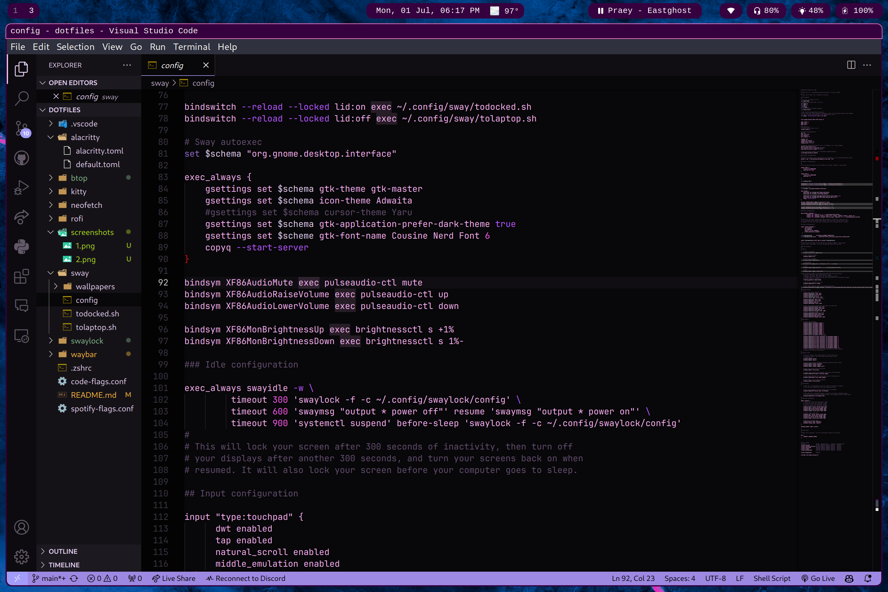
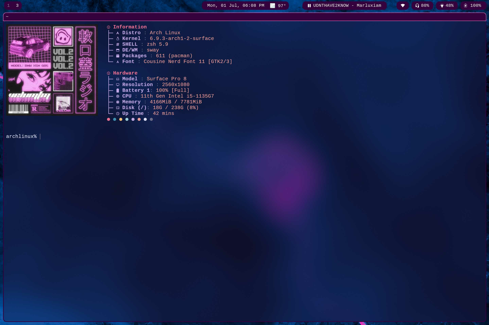

# dotfiles
All my arch installation files and configurations to reproduce the installation.

# Screenshots

# Desktop Environment
* window manager: hyprland
* display manager: ly
* waybar
* rofi-wayland
* kitty 
* zsh

# Packages
* alsa
* pulseaudio
* pulseaudio-ctl
* pavucontrol
* git
* github-cli
* gvim
* neofetch
* firefox
* btop
* spotify
* visual-studio-code-bin
* yay
* wlr-randr
* mc
* swayidle
* swaylock-effects
* grim
* slurp
* wl-copy
* ags
* imv

## Laptop Specific
* poweru
* powertop
* auto-cpufreq
* brightnessctl

# Fonts
* nerdfonts JetBrains
* nerdfonts Cousine

# To-Do
- [ ] fix clipboard history
- [ ] add screenshot saving
- [x] spotify waybar
- [ ] better lid close sleep
- [x] power button actually does something
- [ ] spicetify

# Credits/Inspiration
* [Rose Pine GTK Theme](https://github.com/rose-pine/gtk) (from Rose Pine project)
* [Rofi Theme](https://draculatheme.com/rofi) (from Dracula)
* [Kitty](https://github.com/rose-pine/kitty) (modified from Rose Pine Project)
* [Neofetch](https://github.com/Chick2D/neofetch-themes) (modified ozozFetch from Neofetch themes)
* [Neofetch image](https://pin.it/mn5PhYTWz) (from Pinterest)
* [Waybar](https://github.com/lgaboury/Sway-Waybar-Install-Script) (from Waybar examples tab)
* [Waybar Spotify Module](https://pkg.go.dev/git.hrfee.pw/hrfee/waybar-mpris) (from waybar-mpris go page)
* [VScode theme](https://marketplace.visualstudio.com/items?itemName=shubham-saudolla.lilac) (from vscode marketplace lilac theme)
* [VScode icon](https://marketplace.visualstudio.com/items?itemName=vscode-icons-team.vscode-icons) (from vscode marketplace vscode icons)
