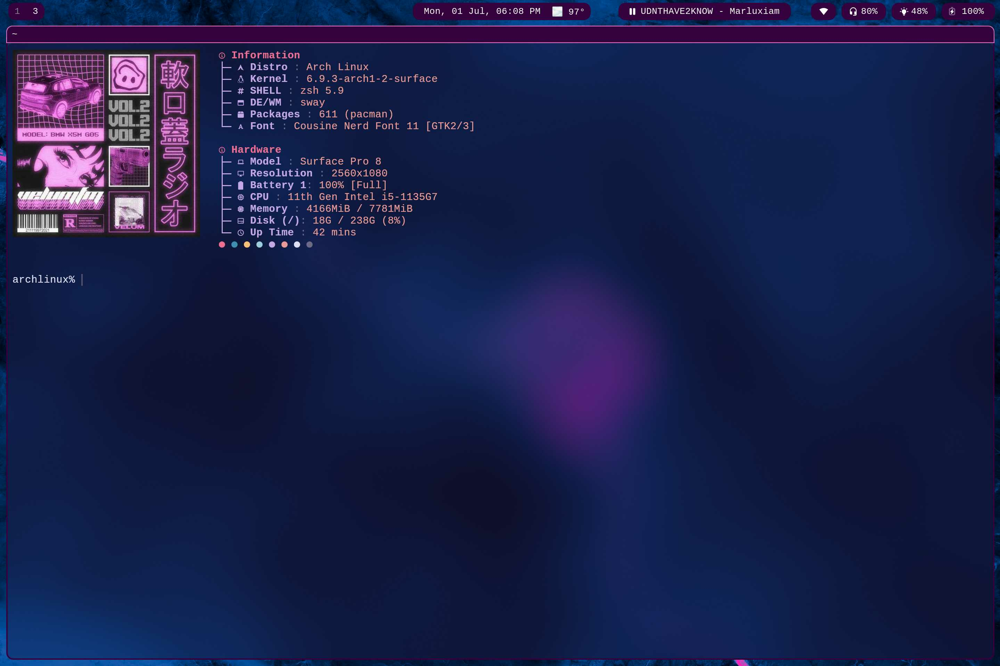
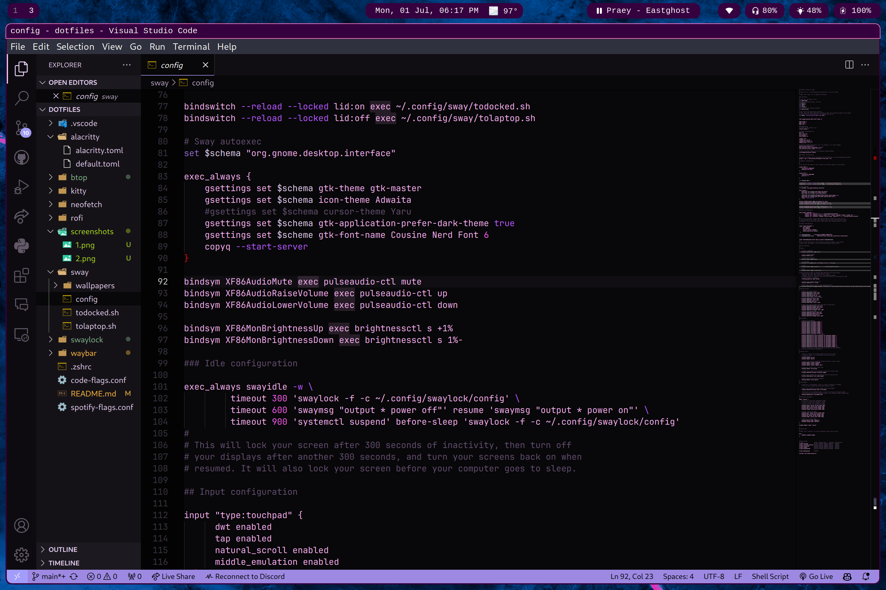

# dotfiles
All my arch installation files and configurations to reproduce the installation.

# Screenshots

# Desktop Environment
* window manager: swayfx
* display manager: ly
* waybar
* rofi-wayland
* kitty 
* zsh

# Packages
* alsa
* pulseaudio
* pulseaudio-ctl
* pavucontrol
* git
* github-cli
* gvim
* neofetch
* firefox
* btop
* spotify
* visual-studio-code-bin
* yay
* wlr-randr
* NCDU
* swayidle
* swaylock-effects
* grim
* slurp
* wl-copy

Laptop specific
* poweru
* powertop
* auto-cpufreq
* brightnessctl

# Fonts
* nerdfonts JetBrains
* nerdfonts Cousine

# To-Do
- [ ] fix clipboard history
- [ ] add screenshot saving
- [x] spotify waybar
- [ ] better lid close sleep
- [x] power button actually does something
- [ ] spicetify
